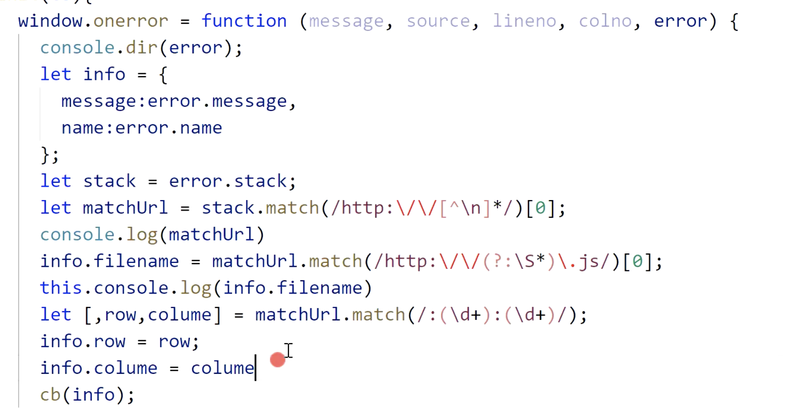

## 前端性能和错误监控框架

### 需要做的事儿

- 监控页面的性能
  - 算时间差 `Performace.timing`
- 监控页面静态资源的加载情况
  - `Performace.getEntriesByType('resouce')`
- ajax 监控ajax发送情况
  - aop重写ajax的 xhr 和 fetch
- 页面的错误捕获
  - 图片加载错误 window.addEventListener('error', fn, true)
  - promise handle事件（自行百度）
  - 代码报错，window.onerror() 压缩需要找到source-map真实报错文件
  - 
- 监控用户的行为
  - 点击事件通过图片src传到服务器
  - pupetter 点击拍照知道点了哪儿（不推荐）