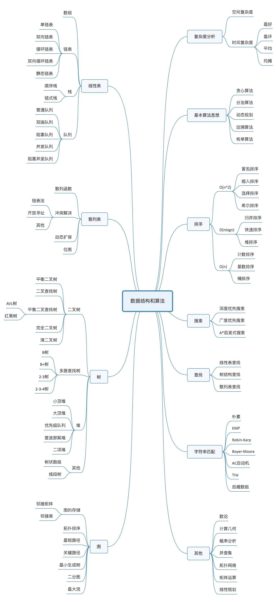

## 如何去学习数据结构和算法

### 前言

不能胡子眉毛一把抓，要学会抓住重点，才能事半功倍。

### 是什么

数据结构指的是“一组数据的存储结构”，算法指的是“操作数据的一组方法”。

数据结构是为算法服务的，算法是要作用在特定的数据结构上的。

### 学什么

- 效率和资源消耗的度衡量 -- 复杂度分析
- 最常用、最基础的20个数据结构和算法，学习他们的：“来历”、“特点”、“适合解决什么问题”、和“实际的应用场景”。
  - 数据结构：数组、链表、栈、队列、散列表、二叉树、堆、跳表、图、Tire数
  - 算法：递归、排序、二分查找、搜索、哈希算法、贪心算法、分支算法、回溯算法、动态规划、字符串匹配算法

### 怎么学

- 边学边练，每周花1~2小时几种攻关三节课涉及到的数据结构和算法，全部手写出来并理解。
- 主动提问、多思考、多互动。在留言区增加自己的留言。
- 自我激励，每次学习完都做一篇学习笔记。
- 沉下心来不要负载，先把这些基础的数据结构和算法，还有学习方法熟练掌握后，再追求更高层次。

### Flag

- 每篇文章必写学习笔记，每周必实现一次三节课的代码。
- 所有数据结构和算法使用JavaScript实现一遍
- 所有数据结构和算法使用Python实现一遍
- 学完溜溜球
- BAT

### Map

### 总结